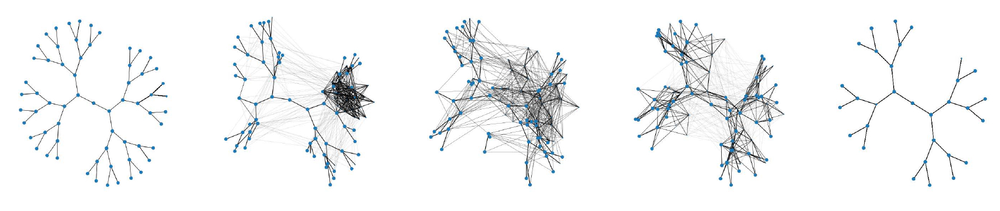
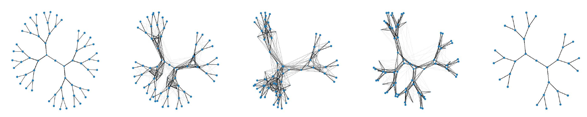

# Generalized Spectral Clustering via Gromov-Wasserstein Learning

This repository is the official implementation of _Generalized Spectral Clustering via Gromov-Wasserstein Learning_.


## Requirements

We highly recommend setting up a virtual environment using conda to test this code, and then installing dependencies using the provided requirements.txt file:

```
conda create -n 2020-sgw-test python=3.6
conda activate 2020-sgw-test
pip install -r requirements.txt
```
Next, please go into the data folder and unzip the REDDIT-BINARY and COLLAB files to obtain:
```
data/REDDIT-BINARY/REDDIT-BINARY*.txt
data/COLLAB/COLLAB*.txt
```

## Evaluate prepared scripts

To replicate the results provided in the paper, simply run the bash script:

```
chmod u+x submit.sh
./submit.sh
```

It may take several hours to generate all the results files. These will be stored in the base folder as **res_*.txt** and **res_*.pdf**. The shell script also includes individual commands that you can run separately.

## Mapping between scripts and tables/figures in paper
| Script    | Table or Figure |
|---|---|
| plot_matchings.py | Figure 1 |
| benchmark*.py  | Tables 3-5 |
| plot_node_correctness.py | Table 2 |
| plot_energy.py | Figure 2 |
| plot_gwa_village.py | Figure 3 |


## References

We describe full references in the paper. A list with links is provided below

**Data:**
- [Stanford SNAP collection](http://snap.stanford.edu/data/index.html#communities)
- [Benchmark datasets for graph kernels](https://ls11-www.cs.tu-dortmund.de/staff/morris/graphkerneldatasets)

**Modules**
- [Python Optimal Transport library](https://pythonot.github.io/)
- [Scalable Gromov-Wasserstein Learning](https://github.com/HongtengXu/s-gwl)
    - DataIO.py, EvaluationMeasure.py, GromovWassersteinFramework.py, GromovWassersteinGraphToolkit.py
- [Gromov-Wasserstein Statistics](https://github.com/trneedham/gromov-wasserstein-statistics)
    - gromovWassersteinAveraging.py, gwaTools.py, geodesicVisualization.py
- [Infomap](https://mapequation.github.io/infomap/python/)
- [Scikit-learn](https://scikit-learn.org/stable/index.html)


## License

This work is covered under an MIT license.